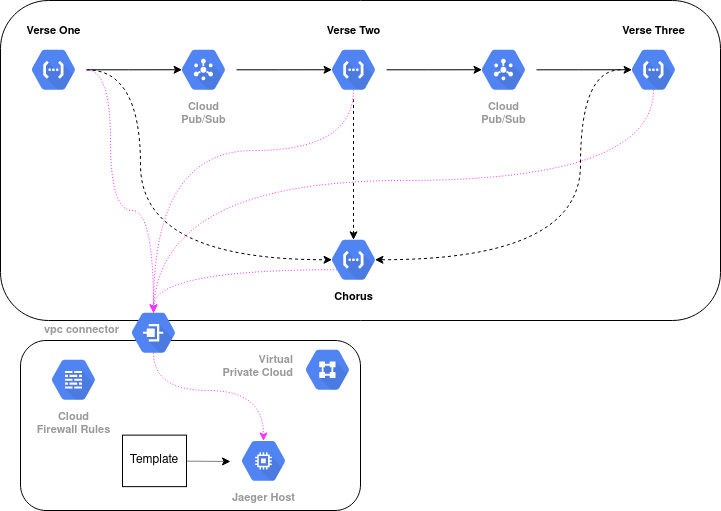
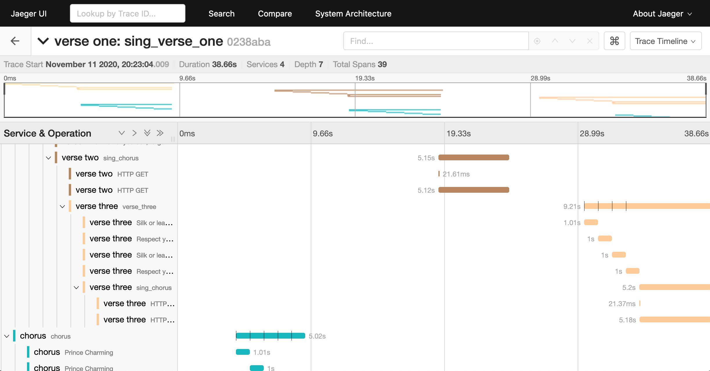

# Prince Charming - Open Telemetry / GCP Demo App

"Ridicule is nothing to be scared of" - Adam Ant 'Prince Charming'

This is a demonstration of using [Open Telemetry](https://opentelemetry.io/)
to instrument a [Google Cloud Functions](https://cloud.google.com/functions)
app.

# Why Prince Charming?

Whilst I found it relatively straightforward to instrument individual
services I could not figure out how 'out of the box' to propagate context
from one service to another, be it by message queue or by HTTP requests.

So I thought I would have a go myself and put the results out there
to get feedback / direction.

I'm often reluctant to do this for fear of looking naive / an idiot.
But as Adam Ant sung "Ridicule is nothing to be scared of" Better to
be wrong and be corrected than to remain ignorant.

So this demo app is a tribute to Adam Ant and a small scale deployment
of OpenTelemetry for Python across four Google Cloud Functions:

Three Cloud Functions represent the verses of the song 'Prince Charming'.
They send the lyrics out via Open Telemetry.

Each verse calls the next one by sending a message, along with its trace
context, via a [Pub/Sub](https://cloud.google.com/pubsub) queue.

Before it does this it calls a function which represents the song's chorus
over http.

The results in [Jaeger](https://www.jaegertracing.io/) look like this:

   
 
The instrumentation is wrapped up in a Python module called 
[barium-meal](https://github.com/peckhamdata/barium-meal).
 
To start the `song` drop a message into the `verse-one` queue.

If you want to deploy this to your own GCP environment you'll find the
[Terraform](https://www.terraform.io/) scripts in the [infrastructure](./infrastructure)
directory along with a [README](./infrastructure/README.md). 
